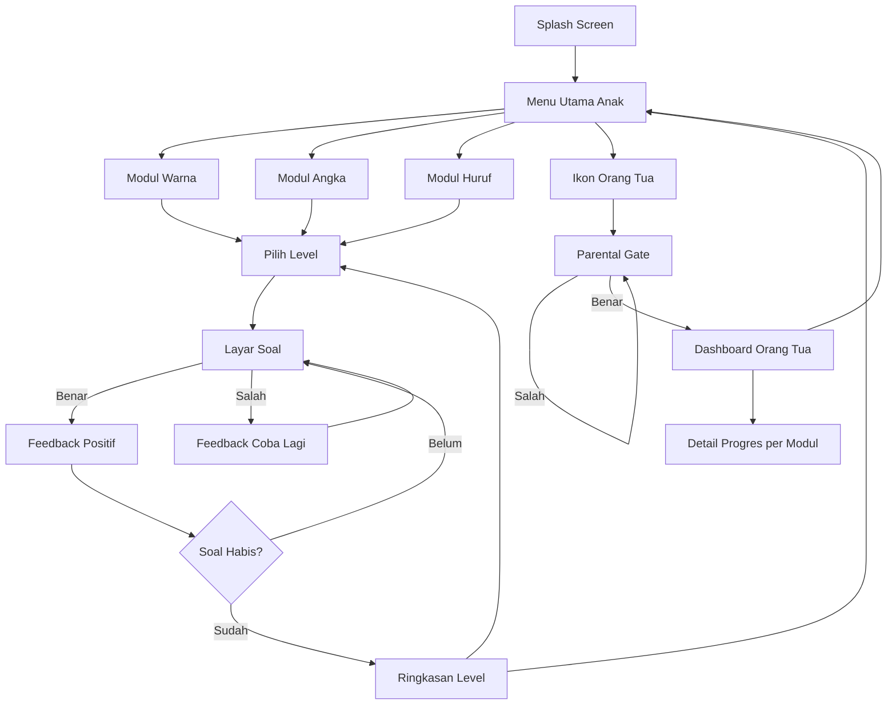

# User Flow — Aplikasi Pembelajaran Anak Pra-Sekolah

**Versi:** 0.1 (Draft MVP)
**Tanggal:** 8 Agustus 2026
**Terkait:** PRD.md

---

## 1. Peta Layar (Screen Map)

```
Splash Screen
   └─ Menu Utama Anak (Home)
         ├─ Modul Warna
         │     └─ Pilih Level → Layar Soal → Layar Feedback → (lanjut soal / kembali ke Pilih Level)
         ├─ Modul Angka
         │     └─ Pilih Level → Layar Soal → Layar Feedback → (lanjut soal / kembali ke Pilih Level)
         ├─ Modul Huruf
         │     └─ Pilih Level → Layar Soal → Layar Feedback → (lanjut soal / kembali ke Pilih Level)
         └─ Ikon "Orang Tua" (pojok layar, kecil)
               └─ Parental Gate (soal verifikasi)
                     ├─ Berhasil → Dashboard Orang Tua
                     │                 └─ Detail Progres per Modul
                     └─ Gagal → kembali ke Parental Gate (coba lagi)
```

---

## 2. Flow Utama: Anak Membuka Aplikasi & Belajar

**Aktor:** Anak (dengan/tanpa pendampingan orang tua)

1. Anak/orang tua membuka aplikasi → **Splash Screen** tampil singkat (logo aplikasi, tanpa loading lama karena offline)
2. Aplikasi langsung masuk ke **Menu Utama Anak** (tidak ada login/onboarding yang menghalangi)
3. Anak melihat 3 kartu besar berwarna-warni: **Warna**, **Angka**, **Huruf** — bebas pilih salah satu (free-choice, tanpa urutan wajib)
4. Anak tap salah satu kartu modul, misal **Warna**
5. Masuk ke **Layar Pilih Level** — menampilkan level yang tersedia (level yang belum pernah dicoba ditandai berbeda dari yang sudah pernah diselesaikan, tapi tidak dikunci/tidak wajib berurutan untuk MVP)
6. Anak tap salah satu level → masuk ke **Layar Soal**
7. Instruksi diberikan lewat **audio** ("Sentuh yang berwarna merah!") + tampilan visual pilihan jawaban
8. Anak tap salah satu pilihan:
   - **Jika benar** → **Layar Feedback Positif** (animasi bintang/karakter + suara "Yeay! Pintar!") → otomatis lanjut ke soal berikutnya setelah beberapa detik
   - **Jika salah** → **Feedback lembut** ("Coba lagi ya!") tanpa hukuman, anak tetap di soal yang sama untuk mencoba lagi
9. Setelah semua soal dalam 1 level selesai (5–10 soal) → **Layar Ringkasan Level** (misal: "Kamu hebat! 8 dari 10 benar" + animasi perayaan)
10. Anak bisa pilih: **Ulangi Level**, **Lanjut Level Berikutnya**, atau **Kembali ke Menu Modul**

**Catatan desain:**

- Tidak ada teks panjang di layar mana pun — semua instruksi utama disampaikan lewat audio
- Transisi antar layar dibuat halus dan cepat (anak usia ini mudah kehilangan minat jika loading lama)
- Tombol besar, area tap luas (mempertimbangkan motorik halus anak yang belum sempurna)

---

## 3. Flow Alternatif: Anak Keluar dari Soal di Tengah Jalan

1. Anak sedang di **Layar Soal**, lalu tap tombol "kembali" (ikon rumah kecil di pojok)
2. Progres soal yang sedang berjalan **tidak disimpan sebagian** — level dianggap belum selesai
3. Anak kembali ke **Layar Pilih Level** atau **Menu Utama**, bisa mulai ulang level tersebut kapan saja

---

## 4. Flow: Orang Tua Mengakses Dashboard

**Aktor:** Orang tua

1. Dari **Menu Utama Anak**, orang tua tap ikon kecil "Orang Tua" di pojok layar (didesain tidak mencolok agar anak tidak asal tap)
2. Muncul **Parental Gate** — soal verifikasi sederhana (misal soal hitung: "7 + 5 = ?" dengan input angka), tujuannya memastikan yang membuka adalah orang dewasa
3. **Jika jawaban benar** → masuk ke **Dashboard Orang Tua**
4. **Jika jawaban salah** → tetap di Parental Gate, muncul soal baru untuk dicoba lagi (tanpa batas percobaan di MVP)

### 4.1 Di dalam Dashboard Orang Tua

5. Orang tua melihat ringkasan 3 modul (Warna, Angka, Huruf) dengan indikator progres masing-masing (misal: level tertinggi yang sudah diselesaikan, jumlah level total)
6. Orang tua bisa tap salah satu modul untuk melihat **Detail Progres** (riwayat level yang sudah dicoba, skor per level)
7. Orang tua tap tombol "Kembali ke Mode Anak" (atau ikon back) → langsung kembali ke **Menu Utama Anak** tanpa perlu verifikasi ulang untuk keluar

**Catatan desain:**

- Tidak ada aksi destruktif berisiko di MVP (misal reset semua data), sehingga dashboard read-only lebih dulu — aman untuk versi awal
- Karena tanpa login, dashboard ini otomatis merepresentasikan progres satu-satunya anak yang menggunakan aplikasi di perangkat tersebut

---

## 5. Flow: Instalasi Pertama Kali (First Launch)

1. Orang tua memasang aplikasi dari APK/Play Store
2. Buka aplikasi pertama kali → **Splash Screen** → langsung ke **Menu Utama Anak**
3. **Tidak ada proses registrasi, login, atau setup profil** — aplikasi siap dipakai seketika
4. Data progres mulai tersimpan secara lokal begitu anak menyelesaikan aktivitas pertamanya (tidak perlu setup manual apa pun oleh orang tua)

---

## 6. Diagram Ringkas (Mermaid)



---

## 7. Keputusan Final (Open Questions — Resolved)

1. **Level berurutan atau bebas dipilih?** — ✅ **Bebas dipilih (tidak terkunci).** Konsisten dengan pendekatan free-choice di PRD. Level yang sudah diselesaikan ditandai dengan visual indicator (bintang/centang) untuk memberi rasa progres tanpa memaksa urutan.

2. **Batas percobaan salah di Parental Gate?** — ✅ **Ya, cooldown sederhana.** Setelah 3 kali salah → tunggu 30 detik sebelum bisa mencoba lagi. Cukup untuk menghalangi anak coba brute-force, tapi tidak mengganggu orang tua yang sekadar salah hitung.

3. **Tombol reset progres di Dashboard?** — ✅ **Tidak untuk MVP.** Dashboard bersifat read-only. Jika perlu reset, orang tua bisa uninstall/reinstall aplikasi. Fitur reset dengan konfirmasi berlapis direncanakan untuk v2.
